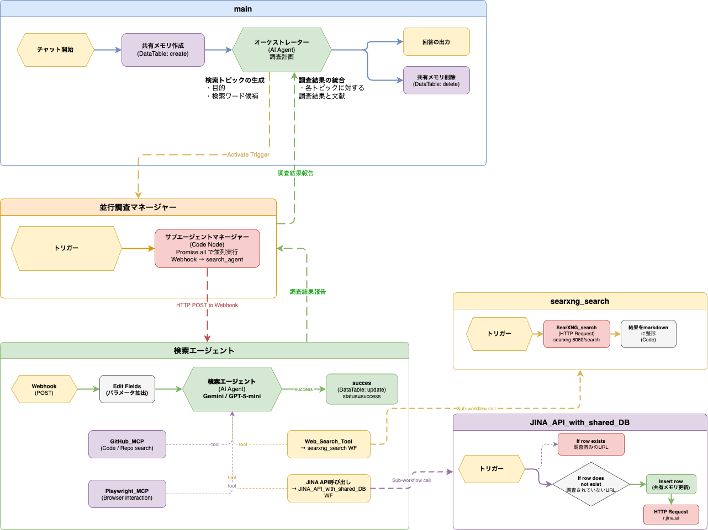

# 検索エージェントシステム
n8nで構築する，複数のエージェントを用いた並列検索システム

## 概要
Web上の情報を効率的に収集し，エージェントによる自律的な探索に基づいた検索を実現するシステムです．

この検索システムは，ひとつのオーケストレーターと複数の検索エージェントから構成されます．オーケストレーターは検索の計画や検索エージェントへの指示を担当し，検索エージェントは実際のWeb検索や情報収集を行います．各エージェントは独立して並列に動作することで，効率的な情報収集を可能にします．

### システム構成
- `n8n`: ワークフロー自動化ツール．オーケストレーターとエージェントのワークフローを管理．(https://github.com/n8n-io/n8n)
- `searxng`: 複数のソースから情報を収集するメタ検索エンジン．(https://github.com/searxng/searxng/tree/master)
- `JINA API`: webページからの情報抽出を行うAPI．(https://jina.ai/)
- 各種MCP
    - `playwright MCP`: Webページの動的コンテンツ取得に使用．(https://github.com/microsoft/playwright-mcp)
    - `GitHub MCP`: GitHubリポジトリの情報収集に使用．(https://github.com/github/github-mcp-server)

### ワークフロー


## Setup
1. セキュリティーキーの設定
    以下の箇所に，ランダムな文字列を設定してください．
    - `docker-compose.yml`内の`N8N_ENCRYPTION_KEY`
    - `searxng/settings.yml`内の`secret_key`
2. Dockerコンテナの起動
    ```bash
    docker-compose up -d
    ```
    `http://localhost:5678`にアクセスして，n8nの初期設定を行ってください．
3. ワークフローのインポート
    `workflows/`のjsonファイルをn8nにインポートしてください．
4. ノードの設定
    LLMノードのAPIキー，JINA APIキー，GitHub MCPのPersonal Access Tokenなどを設定してください．
